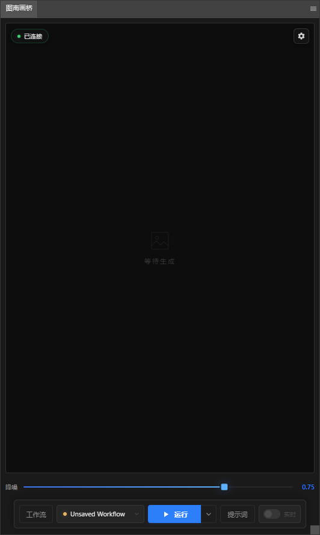
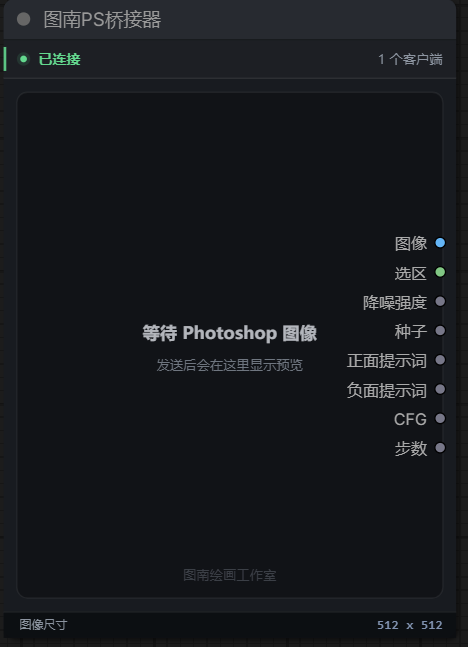
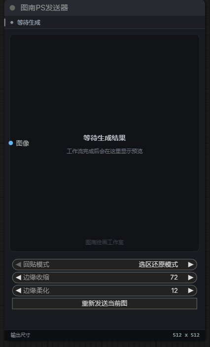

# 🌉 图南画桥 (Tunan Paint Bridge)

> 一个极简、稳定、不折腾的 Photoshop <-> ComfyUI 桥接插件。让 AI 辅助绘画回归创作本身。

[**如果想要安装，请点击查看《安装说明》**](./INSTALL.md)

---

## 🎯 为什么做这个插件？

市面上已经有很多 PS 与 ComfyUI 的桥接插件，但它们往往功能繁多、界面复杂。作为一个绘画创作者，我平时最需要的其实就是**“把 PS 里的画面连同选区发给 AI，大图生回来再贴回 PS”**这一个最痛点的动作。

**“图南画桥”**的诞生就是为了抛弃一切不需要的复杂性，它从画师每天的真实工作流出发设计：

- 没有密密麻麻的参数墙
- 没有眼花缭乱的附加组件
- **只有最关键的核心功能和极致的稳定性**

---

## ✨ 界面与核心功能

这里只需要 **3 个界面**，就能看懂插件是怎么运作的：

### 1. Photoshop 极简面板

- **一键发射**：在 PS 选好区域，点击底部【运行】，无需切换软件。
- **高频滑块**：把唯一需要反复调节的【降噪 (Denoise)】做成高频滑块，快速试调。
- **双击回贴**：出图后，在中央大图上双击，图片会作为智能对象贴回原始区域。
- **历史找回**：面板底部会自动保留历史缩略图，方便回看和比对。

### 2. ComfyUI 接收节点

- **图南 PS 桥接器**：负责把 Photoshop 发来的图像、选区（蒙版）、提示词、降噪强度等接入工作流。

### 3. ComfyUI 回传节点

- **图南 PS 发送器**：负责把 ComfyUI 结果送回 Photoshop，并支持重新发送与回贴策略。

---

## 🚀 核心特色总结

1. **零心智负担**：把复杂流程交给 ComfyUI，把最清爽的创作界面留在 Photoshop。
2. **工作流切换顺手**：支持工作流同步、标签页切换和状态反馈。
3. **断线不死**：内置检测与重连机制，ComfyUI 重启后插件也能恢复连接。

---

## 📥 安装与需求

- **前置要求**
  - 一台能正常运行基础绘画工作流的 **ComfyUI**
  - 较新版本的 **Photoshop**，推荐 2022 及以上版本

- **详细安装教程**
  - [安装说明](./INSTALL.md)
  - [ComfyUI 节点说明](./comfyui-nodes/README.md)

---

## 📦 发布内容

每个公开版本通常会提供：

1. Photoshop 插件 `.ccx`
2. ComfyUI 节点 zip
3. 同时包含两者的总安装包 `bundle.zip`

如果官网下载页还没有同步上线，请直接查看当前仓库的 Releases。

---

## 🤝 作者与版权

- 制作人 / 作者：北月（Beiyue）
- 制作团队：图南绘画工作室
- License：MIT

Copyright (c) 2026 Beiyue / Tunan Painting Studio

---

## 💬 开发者的话

因为市面上许多强大的扩展往往会让小白和插画师感到“这不是用来画画的，而是用来当程序员的”。所以我写了这个简单的桥梁。

因为只保留了核心链路，所以代码会尽量保持纯净，不去堆和创作主流程无关的复杂性。

如果你在安装或使用过程中遇到问题，欢迎通过仓库 Issues 反馈。

## 📮 联系方式

- Issues：GitHub Issues
- Email：76030821@qq.com
- QQ：76030821
